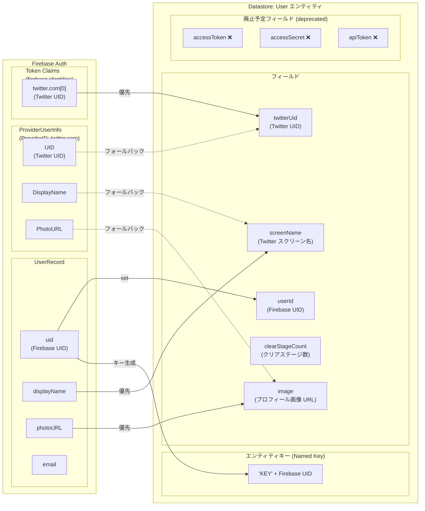
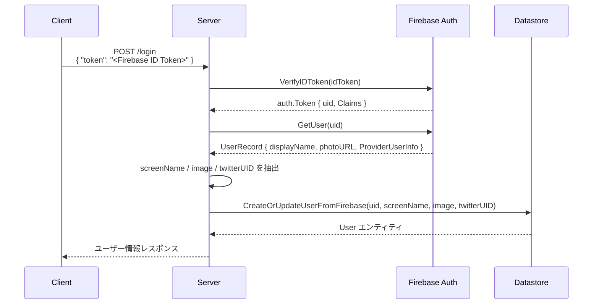

# 認証情報の関連図

Firebase Auth ベースの認証と Datastore の User エンティティのデータ項目の関係を示す図です。

## データ項目マッピング図

## 各フィールドの説明

### Firebase Auth → Datastore User マッピング

| Firebase Auth フィールド | Datastore User フィールド | 優先度 | 説明 |
|---|---|---|---|
| `UserRecord.uid` | `userId` | - | Firebase UID をそのままコピー |
| `UserRecord.uid` | キー (`KEY{uid}`) | - | エンティティキーの名前として使用 |
| `UserRecord.displayName` | `screenName` | 優先 | Twitter スクリーン名（Firebase Auth の DisplayName） |
| `ProviderUserInfo["twitter.com"].DisplayName` | `screenName` | フォールバック | displayName が空の場合に使用 |
| `UserRecord.photoURL` | `image` | 優先 | Twitter プロフィール画像 URL |
| `ProviderUserInfo["twitter.com"].PhotoURL` | `image` | フォールバック | photoURL が空の場合に使用 |
| `Token.Claims["firebase"]["identities"]["twitter.com"][0]` | `twitterUid` | 優先 | Twitter UID（トークンクレームから取得） |
| `ProviderUserInfo["twitter.com"].UID` | `twitterUid` | フォールバック | クレームから取得できない場合に使用 |

### アプリケーション管理フィールド

| フィールド | 説明 |
|---|---|
| `clearStageCount` | 認証とは無関係。ユーザーがステージをクリアするたびにアプリケーション側でインクリメント |

### 廃止予定フィールド (deprecated)

旧 Twitter OAuth 直接連携で使用されていたフィールド。Firebase Auth 移行後は不使用。

| フィールド | 旧用途 | 現状 |
|---|---|---|
| `accessToken` | Twitter OAuth アクセストークン | 廃止予定（TODO: 削除） |
| `accessSecret` | Twitter OAuth アクセスシークレット | 廃止予定（TODO: 削除） |
| `apiToken` | カスタム API トークン | 廃止予定（TODO: 削除） |

## ログインフロー概要

